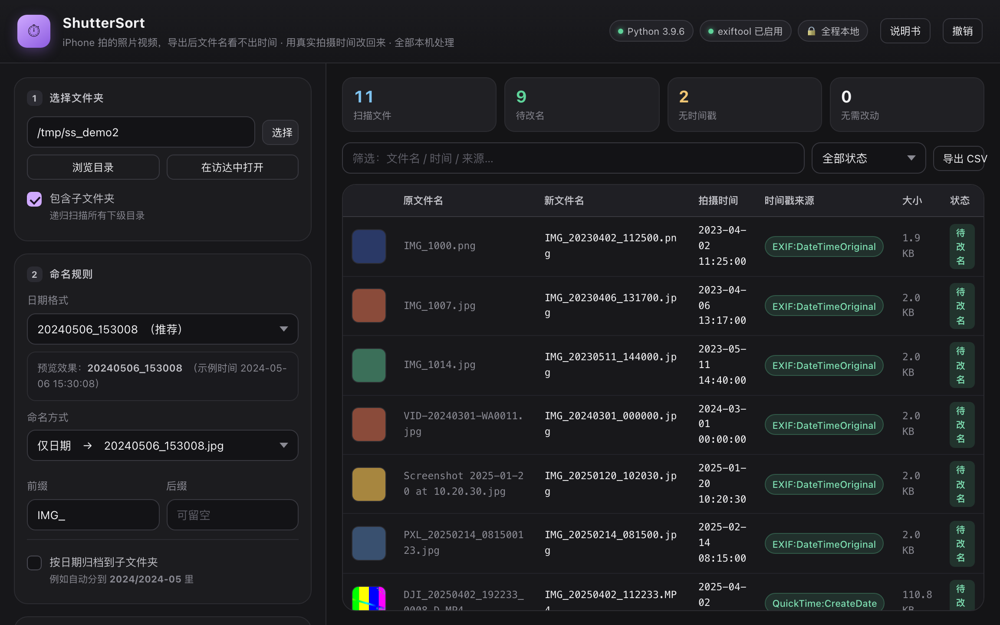
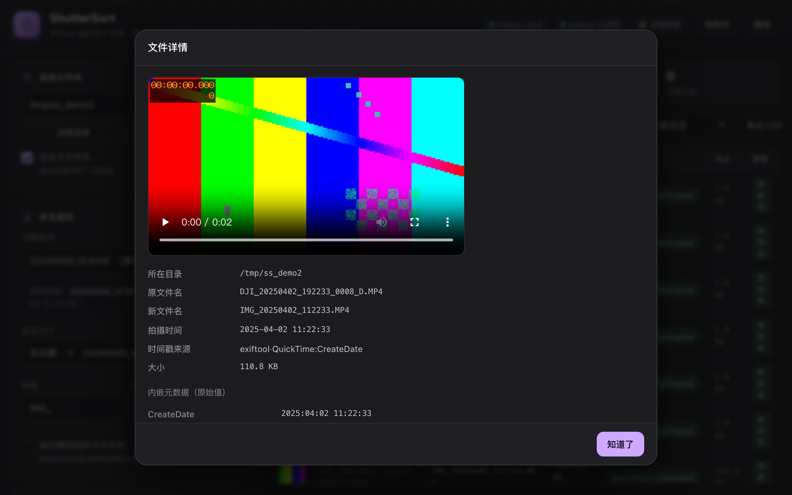
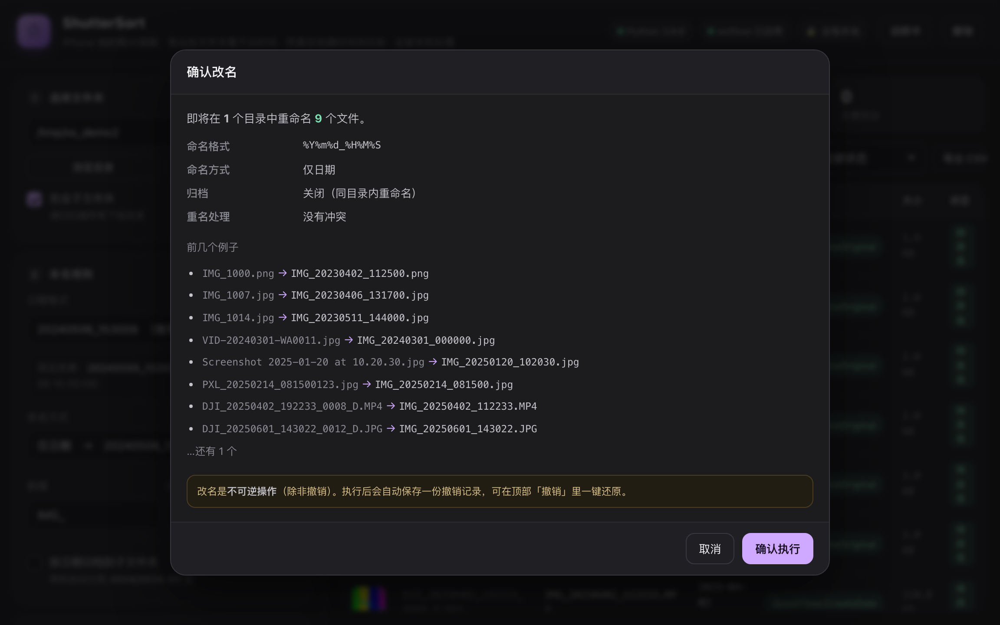
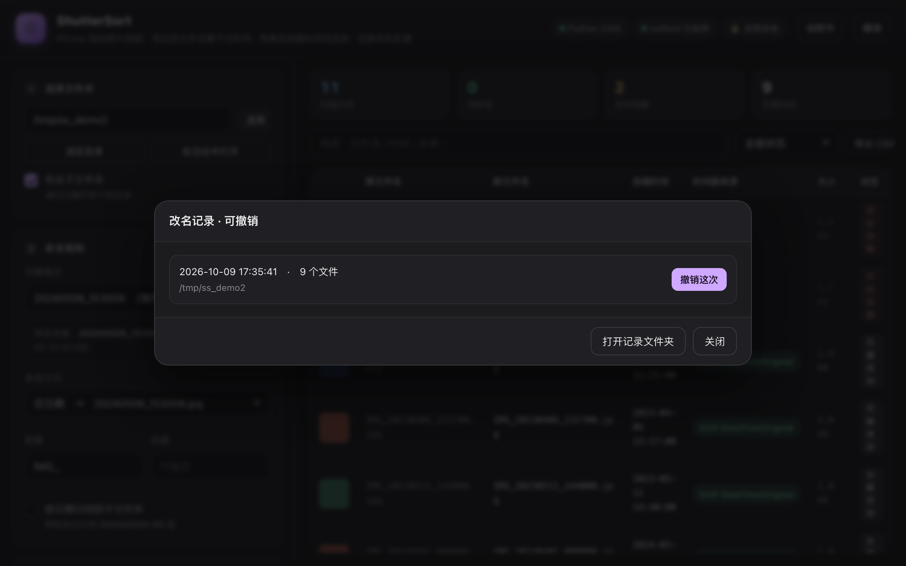

<div align="center">

# ShutterSort

**把 iPhone 的拍摄时间写回文件名。**

用 iPhone 拍的照片和视频，导出到电脑后名字永远是一串看不出来时间的流水号 ——
读回文件内嵌的真实拍摄时间，原地重命名，让整个文件夹自动按时间排序。

[](LICENSE)
[](https://www.python.org/)
[]()
[]()
[](#开发与测试)

简体中文 · [English](README.en.md)

</div>

---

用 iPhone 拍的照片和视频，导出到电脑、移动硬盘或云端之后，名字是一串看不出时间的流水号：

```
IMG_8734.HEIC
IMG_8734.MOV
IMG_8741.HEIC
```

名字里没有时间。几百上千张堆在一个文件夹里，按文件名排序就是一团乱麻 ——
想找「上个月在老家拍的那张」，只能一张张双击点开看。

ShutterSort 只做一件事：**把文件名换成真实拍摄时间**。

```
IMG_8734.HEIC   →  IMG_20240506_153008.HEIC
IMG_8734.MOV    →  IMG_20240506_153012.MOV
IMG_8741.HEIC   →  IMG_20240506_154421.HEIC
```

改完之后，文件夹自动按拍摄时间排序，跟手机相册里看到的时间线一致。
文件名本身就是时间，搜索、备份、跨设备同步全都顺畅了。

## 它和普通批量改名工具的区别

| 能力 | 普通批量改名工具 | ShutterSort |
| --- | :---: | :---: |
| 读取照片拍摄时间（EXIF / XMP / PNG / HEIC / RAW） | 部分 | ✅ |
| 读取视频拍摄时间（MP4 / MOV 容器内嵌时间） | 多数不支持 | ✅ |
| 读取聊天软件导出的文件（从文件名解析） | 基本不支持 | ✅ |
| 读取 Google Takeout 导出（`.json` 旁车） | 不支持 | ✅ |
| **告诉你时间是哪儿来的** | 不告诉 | ✅ 每个文件都标注来源，可核对 |
| 撤销 | 多数只支持当次 | ✅ 记录落盘，重启后仍可撤销 |
| 重复执行结果稳定（幂等） | 常出问题 | ✅ |
| 安装依赖 | 要装一堆包 | ✅ **零依赖**，纯 Python 标准库 |

## 界面

**预览——改名字之前先看清楚，此时文件还没有被改动：**



每个文件都带一个彩色「时间戳来源」标签，一眼看出整批数据的质量分布。
截图里 `QuickTime:CreateDate` 是视频容器内嵌时间，`EXIF:DateTimeOriginal` 是照片 EXIF，
灰色「缺失」代表元数据被处理掉了（聊天软件转发件），默认跳过、绝不瞎猜。

**点任意一行，查看这个时间的出处和原始元数据：**



**动手前二次确认，列出目录数、命名参数、冲突数和样例：**



**每次改名都落盘成撤销记录，重启之后依然可以一键还原：**



## 快速开始

### 源码模式（推荐，无需安装任何东西）

要求：macOS + Python 3.8+（macOS 自带）。

```bash
git clone https://github.com/js-ping/shuttersort.git
cd shuttersort
./start.command          # 双击这个文件也行
```

会弹出一个终端窗口，然后浏览器自动打开操作界面。
**没有 `pip install`，没有虚拟环境，没有配置文件** —— 全部功能只用 Python 标准库实现。

### App 模式（打包成独立 .app，双击即用）

```bash
python3 -m pip install pyinstaller pywebview   # 只需一次
cd packaging
./build_app.command
```

产物是 `packaging/dist/ShutterSort.app`：原生窗口、关窗即退出、电脑上不需要装 Python。

### 可选增强

| 工具 | 作用 | 没装会怎样 |
| --- | --- | --- |
| `exiftool` | 第一优先级的元数据提取，覆盖度最高 | 自动改用内置解析器，功能完整 |
| `ffmpeg` | 视频缩略图预览 | 显示 🎬 图标，不影响改名 |

```bash
brew install exiftool ffmpeg    # 想要最强元数据覆盖就装上
```

## 工作原理：时间戳优先级

程序按固定顺序一层层往下找，**第一个成功的就是最终结果**。
界面上每个文件都标注用了哪一层，这让改名结果**可审计、可复现**。

| 顺序 | 来源 | 说明 |
| :---: | --- | --- |
| 1 | **exiftool**（若已安装） | 覆盖度最高的标准元数据提取 |
| 2 | **容器内嵌时间**（MP4/MOV/HEIC） | `com.apple.quicktime.creationdate` → `mvhd` → `mdhd`，UTC 自动换算本机时区 |
| 3 | **XMP**（JPEG/PNG/WebP 内嵌） | `xmp:CreateDate`、`photoshop:DateCreated` |
| 4 | **EXIF**（JPEG/TIFF/RAW/WebP） | `DateTimeOriginal` → `DateTimeDigitized` → `DateTime`，支持 `OffsetTime*` 时区与 `SubSecTime*` 毫秒 |
| 5 | **PNG `tIME` 块** | 手机截图的救命稻草 |
| 6 | **Google Takeout `.json` 旁车** | Google 相册导出附带的准确拍摄时间 |
| 7 | **`.xmp` 旁车** | 修图软件写在与图片同名的 `.xmp` 里 |
| 8 | **文件名解析** | 10 种常见命名模式，见下表 |
| 9 | **文件系统时间**（需手动开启兜底） | 明确提示：这是文件落盘时间，不是拍摄时间 |
| 10 | 都没有 | 跳过并标记「无时间戳」，**绝不瞎猜** |

### 内置解析器

不装 exiftool 也完整可用，因为核心格式全部是自研二进制解析（纯标准库）：

- **JPEG/TIFF/RAW EXIF**：自研 TIFF/IFD 遍历，支持 ARW / NEF / CR2 / DNG / RW2 / ORF / SRW 等 TIFF 系 RAW
- **ISOBMFF（MP4/MOV/HEIC/AVIF）**：自研 box 结构解析，`keys` + `ilst` 取 QuickTime 创建时间，回退 `mvhd` / `mdhd`
- **HEIC/HEIF**：自研 `meta` → `iinf` / `iloc` 定位 Exif item，另有 TIFF 魔数扫描兜底
- **PNG / WebP**：自研 chunk 解析（`tIME` / `eXIf` / EXIF / XMP chunk）

### 文件名识别（10 种模式）

| 格式 | 例子 |
| --- | --- |
| DJI Fly | `dji_fly_20251108_164116_0042_D.MP4` |
| DJI | `DJI_20251108_164116_0042_D.MP4` |
| IMG_ / VID_ | `IMG_20250418_193012.jpg` |
| 连续 14 位 | `IMG_20200101000000_0001.jpg` |
| 通用 | `20251111_184839.png` / `2025-11-08_16-41-16.mp4` |
| WhatsApp | `IMG-20240125-WA0001.jpg` |
| 截图 | `Screenshot 2024-09-15 at 10.20.30.jpg` |
| 中文日期 | `2024年5月6日 活动.jpg` |
| 微信 / 相机 | `PXL_20240506_153008123.jpg` |

> **纯数字编号不会被误判**。`1000000034.jpg` 这种不构成合法日期的名字，程序会认出来并跳过；
> UUID、长哈希文件名同理，另外还有年份合法性校验兜底。

## 命名规则

**默认输出：`IMG_20261012_122123.jpg`** —— 前缀 `IMG_` + 日期格式 `%Y%m%d_%H%M%S`，
两项都能在界面上改（前缀留空就变成 `20261012_122123.jpg`）。

| 命名方式 | 结果示例（下表示例不含前缀） |
| --- | --- |
| 仅日期（默认） | `20240506_153008.jpg` |
| 日期_原名 | `20240506_153008_IMG_8734.jpg` |
| 原名_日期 | `IMG_8734_20240506_153008.jpg` |
| 仅原名 | `IMG_8734.jpg`（只加前后缀） |

> 加上默认前缀 `IMG_` 之后，「仅日期」的实际结果就是 `IMG_20261012_122123.jpg`。

日期格式支持 `%Y %m %d %H %M %S %j` 等占位符，可以自定义（例如 `%Y年%m月%d日`），
也支持 **按日期归档到子文件夹**（如 `2024/2024-05/`）。

冲突处理：目标名已存在时自动加 `_1`、`_2` 后缀；冲突检测会排除「文件自身」和「本轮即将腾出的旧名」，
所以**重复执行结果稳定**——已经改好的文件再次扫描时会显示「无需改动」，不会被再改一次。

## 数据安全与隐私

- ❌ **不联网**。服务只监听 `127.0.0.1`，外部无法访问
- ❌ **不上传**任何文件、文件名或元数据
- ❌ **不修改文件内容**。只做重命名（勾选归档时多做一步移动）
- ✅ 改名和撤销都有冲突保护，绝不覆盖已有文件
- ✅ 全部 49 项自检都在系统临时目录里跑，不碰真实文件

## 性能

| 规模 | 表现 |
| --- | --- |
| 100 张照片 | 1 秒以内 |
| 10 000 个文件 | 20–60 秒（取决于硬盘速度） |
| 单个 4 GB 4K 视频 | 只读文件头的 box 结构（几百字节），毫秒级 |

并行扫描默认按 CPU 核心数自动决定并发数；视频只读文件头，不整读进内存。
界面表格最多渲染 1500 行保证流畅，改名仍然作用于全部文件。

## 项目结构

```
ShutterSort/
├── start.command              ← 双击启动（源码模式）
├── src/
│   ├── media_time.py          ← 时间戳解析引擎（核心）
│   ├── server.py              ← 本地服务 + 全部接口
│   ├── app_main.py            ← macOS 原生窗口入口
│   └── static/index.html      ← 界面（单文件，无构建步骤）
├── tests/selftest.py          ← 49 项回归自检
├── packaging/                 ← 打包成 .app
├── screenshots/               ← README 截图
└── rename-history/            ← 运行时生成：撤销记录（不要删）
```

## 开发与测试

```bash
python3 tests/selftest.py       # 或双击 tests/run_tests.command
```

49 项自检覆盖：内置解析器（9 种格式 → 预期时间）、文件名规则、命名引擎、
HTTP 全链路（扫描 → 预览 → 改名 → 幂等复扫 → 撤销）、接口安全（路径穿越防护）。
全程在临时目录操作，跑完自动清理。

## 常见问题

**Q：为什么有些文件显示「无时间戳」？**
这些文件的元数据被处理掉了（微信/QQ/WhatsApp 转发、截图工具二次编辑、在线编辑器保存）。
可以在「时间戳来源」里开启文件时间兜底，或保持跳过。

**Q：时间差了几小时？**
EXIF 时间本身不带时区，程序无法凭空推断。带时区的时间源（容器 `creationdate`、带 `OffsetTime` 的 EXIF）会自动换算，不会差。

**Q：改完名字会影响照片 / 视频本身吗？**
不会。原地重命名只改文件名，文件内容一个字节都不动。

**Q：支持 Windows / Linux 吗？**
源码模式理论上跨平台（浏览器界面 + 标准库），但项目在 macOS 上开发和测试，
Windows/Linux 未经验证，遇到问题欢迎提 issue。

## 许可证

[MIT](LICENSE)
